# nikroulah Miryoku — layer reference

This doc was mostly generated by 🤖 Claude Code and then skimmed through and edited briefly by me.

My personal [Miryoku](https://github.com/manna-harbour/miryoku) QWERTY for the
**bastardkb skeletyl** (`split_3x5_3`) and the **ferris/sweep**
(`split_3x5_2`). At a high level, it keeps with miryoku's philosophy of using layers and both hands.

Some areas where I exercised my personal preference:
* I predominantly use a MacOS device, so the home row modifier keys are in the order you would find them on a MacBook keyboard. Namely, Shift, Control, Alt, Cmd/GUI. If I ever use a split ergo on PC for any significant period of time I may update this with some configuration mappings that switch between a Windows and a MacOS setup.
* The nav and mouse layers use a WASD-like formation for arrow- and mouse-keys, though I keep the one-row config for home/pgdn/pgup/end and for mouse wheel scrolling.
* Rather than use thumb combos and pressing both thumb keys together on a 3x5_2, I opt to move some layer-taps onto alpha keys.
* The num and sym layers are swapped to be used by the right-hand, as that is what I'm used to using a keypad with. This partially motivates the above, since I want to put all four of arrow keys, mouse keys, numpad, and shifted numpad on my right hand, so I'm not able to cleanly put all four layerss on left-thumb thumb keys.

Layer images below are the **skeletyl**; the sweep is functionally identical and
shown at the end. They're generated from the qmk_viewer render maps (which come
straight from `miryoku_nikroulah_alternatives.h`) by `docs/gen_layer_images.py`,
so they can't drift from the firmware. Holds are shown as the small legend under
each key; the bottom row is the thumbs. Layers are numbered in Miryoku enum
order (the number qmk_viewer shows): the blank `Extra`/`Tap` slots are omitted.

## Base

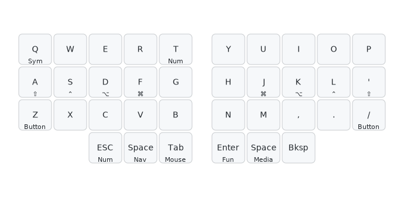

Normal base layer miryoku stuff with alphas, quote instead of semicolon, and `,./`. Space is duplicated on both thumbs, and there is no delete key becausse I have no need for that key.

## Button

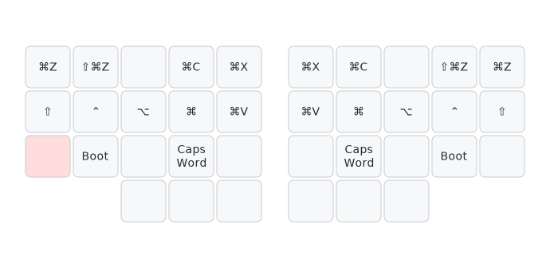

Accessed via lower-column pinky holds.

## Nav

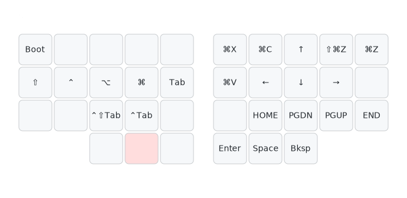

## Mouse

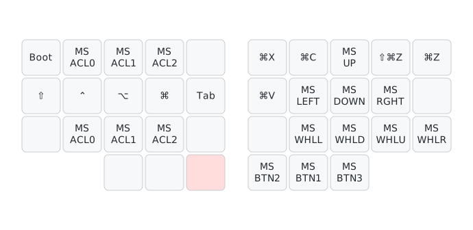

Mouse cursor and scroll-wheel movement on the right hand, with the three
momentary acceleration keys (slow / med / fast) on the left bottom row. See [Mouse & scroll settings](#mouse--scroll-settings).

## Media

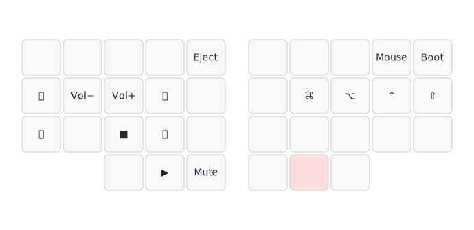

Transport and volume — play/stop/prev/next, rewind/fast-forward, volume ±, mute,
and eject — with the right-hand mods available for modified media actions. Also
carries a double-tap-to-bootloader key.

## Num

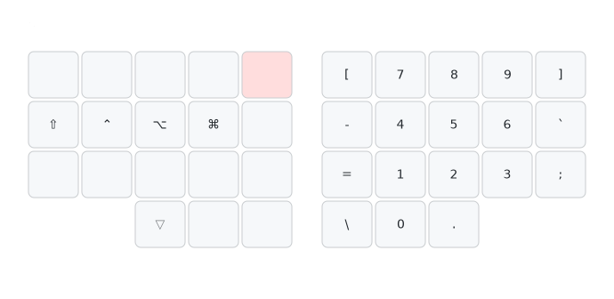

Mirrored from stock miryoku onto the right hand for muscle memory, and with the surrounding symbols laid out in a way that makes more sense to me.

## Sym

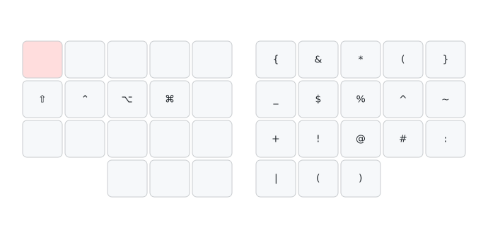

Shifted num layer.

## Fun

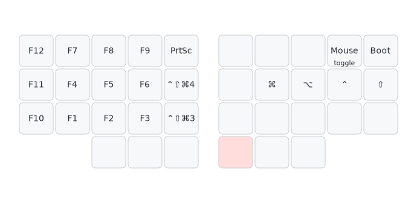

Function keys and MacOS screenshot-to-clipboard chords.

## Sweep

A side-effect of my moving two layers onto left-hand alpha holds is that I'm already basically using two thumb layer-taps per side, which makes my 3-thumb layout basically identical to my 2-thumb one. I drop Tab on the base layer thumb keys here, and the duplicated Space, move Enter to a left thumb, and rely on the duplicated Tab on the nav and mouse layers for Cmd-Tabbing between apps and Ctrl-Tabbing between browser and IDE tabs.

Sweep layer images

### Base
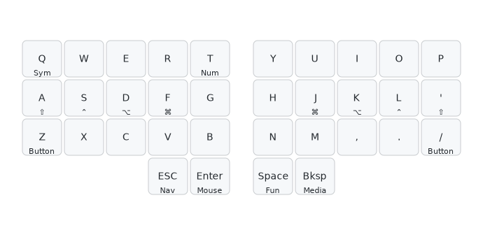

### Button
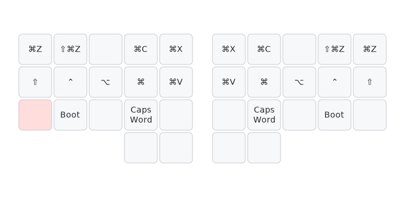

### Nav
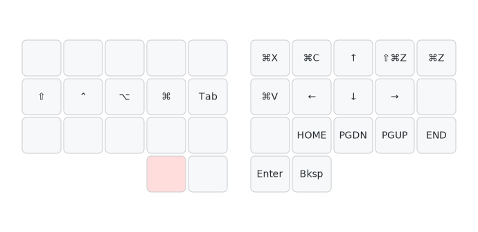

Space becomes Enter on the right thumb cluster, since that is a more common key to want while navigating with arrow keys imo.

### Mouse
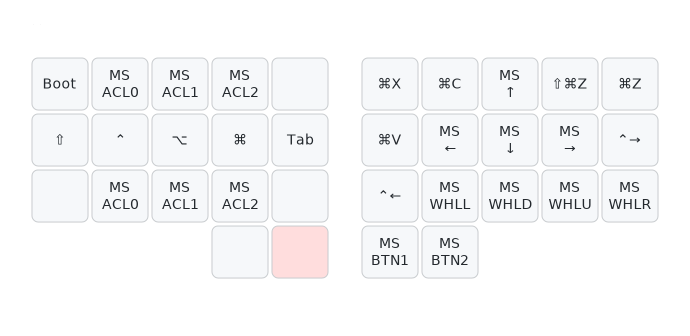

### Media
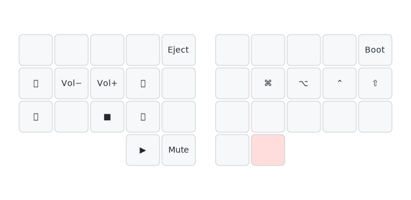

### Num
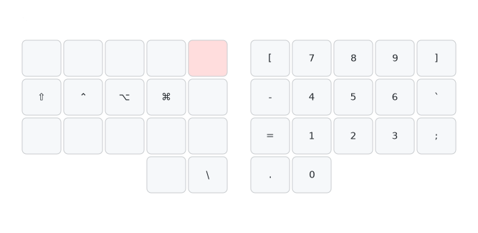

No third thumb key, and I think I do want to keep the dot duplicated onto the num layer and the open paren next to the shifted 0 on the sym layer, so backslash/pipe shift onto the left thumb here. This is okay since the num/sym layers are pinky/index holds, instead of thumb holds like stock miryoku.

### Sym
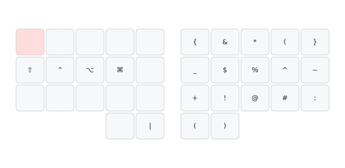

### Fun
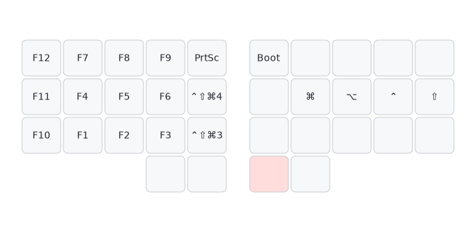

## Mouse & scroll settings

The mouse keys are intentionally **high-offset, high-interval, on constant-speed
mode** (`MK_3_SPEED` + `MK_MOMENTARY_ACCEL`) with momentary ACL speed keys,
because I prefer to rapidly **tap** my mouse-movement keys to jump around by a
predictable amount rather than try to hold them for a specific duration. Each tap moves a fixed distance (default cursor offset 25 px); the acceleration keys (slow med / fast) only change speed while held.

The intervals are set to a multiple of **50 ms** because that's a whole number
of frames at 60 fps (3 frames), so steps line up with the display refresh —
although obviously there can still be some jitter, and arguably targeting exactly a whole number of frames is not the right solution. Possibly some ffxiv-fps-opti-like solution is what we need here lol.

Tune the offsets (px per step) and intervals (ms between steps) in
`users/nikroulah/config.h`.
